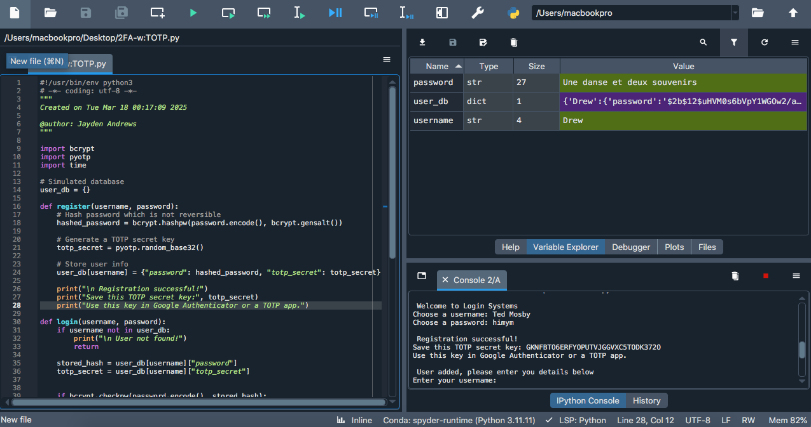

# Two-Factor Authentication (2FA) Using Python (TOTP-Based)

This project demonstrates TOTP (Time-based One-Time Password) 2FA in Python using pyotp and bcrypt. It simulates the login process where a user:

1.User enters their username & password

If the credentials are wrong, access is denied.

If correct, they move to the 2FA step.

2FA Step (TOTP Authentication)

2. The script generates a unique secret key per user.
   
The user manually enters the key in their Authenticator app (Google Authenticator, Authy, etc.).

The script shows the current TOTP code for reference.

3. User enters the TOTP code from the app

If it matches, authentication succeeds!

If incorrect, access is denied.

## Why TOTP?
TOTP (Time-based One-Time Password) is widely used in real-world authentication systems like Google Authenticator, Microsoft Authenticator, and Authy.

More secure than SMS-based 2FA (which can be intercepted).

Offline – No internet needed to generate the code.

Industry standard – Used in OAuth, OpenID, and enterprise security.

## How does 2FA work?
Google Authenticator is a TOTP-based 2FA app that generates 6-digit codes every 30 seconds using a shared secret key and the current time. When logging in, users enter this code along with their credentials. The server, knowing the same key, verifies the code using TOTP (HMAC-SHA1). This method is secure, phishing-resistant, and works offline. Python’s pyotp library follows the same standard, making it easy to integrate into applications.
